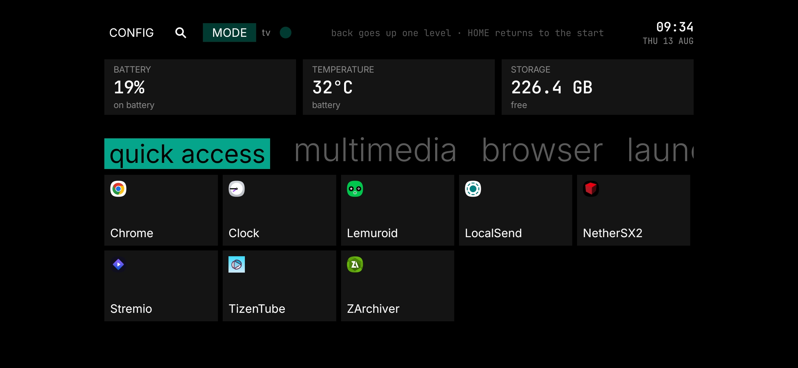
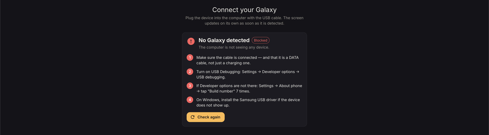
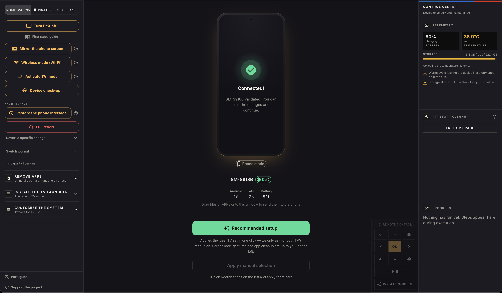

# Revya — Preparing a Samsung to be used on the TV over HDMI

[Português](./README.md) · **English**

[](https://github.com/frx7-nat/revya-desktop/releases/download/v1.0.0/linux-Revya-1.0.0.AppImage)
[](https://github.com/frx7-nat/revya-desktop/releases/download/v1.0.0/windows-Revya-1.0.0-instalador.exe)
[](https://github.com/frx7-nat/revya-desktop/releases/download/v1.0.0/macos-Revya-1.0.0-intel.dmg)
[](https://github.com/frx7-nat/revya-desktop/releases/download/v1.0.0/macos-Revya-1.0.0-arm64.dmg)





Before we get started, program isn't available on the Play Store because
the layer of changes made by the program is necessary to get the most out
of using it.

So it's a process that necessarily has to happen through the computer.

The system is tuned for the big screen, unnecessary apps are removed,
and the launcher is installed and set as default.

The one that does this preparation — from the computer, over cable — is
this program. **It's the only way in**: there's no installing the launcher
by itself from the Play Store, because it depends on the device
already being ready to receive it.

Revya is the bridge between the phone you have today and the TV box you
want to have.

## Features

### Preparing the Revya TV launcher — the core function
With the Galaxy connected by cable, the recommended preset applies everything
that's safe on any device in one go: removes bloatware per user (reversible),
tunes the system for TV use (font, animations, sound, screen always on), and
installs the **Revya TV** launcher, setting it as the TV mode default.
Resolution is the only setting the program asks about — every TV is
different. Everything is verified directly on the device, not a promise in
the dark: the program checks that the launcher actually got installed and set
as default before marking the step done.

### Installing apps and emulators
The program ships with no third-party app embedded — no streaming, no
emulator, no tool. You drag the `.apk`, `.apkm` or `.xapk` you already have
onto the Revya window, and it installs straight to the phone over the cable,
no store involved. That's how you build the TV with the apps and emulators
you already use.

### Transferring files
The same drag-and-drop also moves movies, music, photos and emulator ROMs to
the phone — each file type already lands in the right storage folder, no
need to navigate Android's folder structure by hand.

### Switching between phone mode and TV mode
The device isn't locked to one mode. One click switches between the TV
experience and everyday phone use, and whatever was customized on each side
is preserved — the resolution you found ideal for the TV stays there next
time, and the phone comes back exactly as it was. Technical detail on how
that's kept, right below in "The two modes."

### Device maintenance
Check-up confirms the applied settings still hold (Android rewrites some of
them on its own). Revert undoes any change, one at a time or all at once,
guided by a record that survives switching computers. Cleanup frees up app
cache without deleting any data.

---

Free — revenue comes from donations (Pix and PayPal) and affiliate links on
accessories, no paid tier, no license, no telemetry. Bilingual: Portuguese
and English, 698 catalog keys.

## The two modes

The core concept of the app, and what separates this project from an ADB
script: the device **switches** between phone mode and TV mode, as many
times as the user wants, without losing what was customized on either side.

Each entry in the revert log keeps three layers:

| layer | what it is |
| --- | --- |
| `revert` | the ORIGINAL state, from before the first application |
| `phoneRevert` | the LIVE snapshot of phone mode, recaptured every trip back to TV |
| `task` | the live TV profile — whatever the user tweaked becomes the new profile |

Without the middle layer, going back to phone mode would return the device
to a state from months ago. Without the third, the user would lose the
resolution and rotation they found worked for their TV. Each task's
`modeScope` (`mode` or `structural`) is what decides what switches and what
stays.

## Structure

```
src/
  adb/
    adb.js              Low-level wrapper around adb (commands per function)
    adbDiagnostics.js   ADB state diagnostics in plain language
    adbOrchestrator.js  Detection + automatic ADB server recovery
  i18n/
    pt.json / en.json   JSON catalogs
    index.cjs           Translation core, in CommonJS — BOTH processes read it
  main/
    main.js             Electron main process + IPC handlers + mode bridge
    preload.js          Secure bridge (contextBridge) main <-> renderer
    runner.js           Orchestrator: catalog task -> ADB calls (+ verification)
    revertStore.js      Revert log on disk (by factory serial)
    settingsStore.js    Program preferences (today just the language)
    scrcpy.js           Device screen mirroring (scrcpy)
  renderer/
    Root.jsx            Entry gate: "Connect your Galaxy" screen before App
    App.jsx             3-column layout and application state
    theme/theme.js      MUI theme (dark, amber accent)
    theme/tokens.js     Color tokens for the technical panels (BMW M design)
    data/tasks.js       Modification catalog + recommended preset (auditable)
    data/contribute.js  Donation (Pix/PayPal) and accessories with affiliate link
    utils/locale.js     Numbers and dates per language
    screens/
      ConnectPhoneScreen.jsx  Gate screen with live ADB diagnostics
    components/
      TaskPanel.jsx         Left tab  — modifications, check-up and revert
      DevicePanel.jsx       Center tab — device, preset, Wi-Fi, mirroring
      ProgressPanel.jsx     Right tab  — step-by-step progress + report
      ControlCenter.jsx     Control Center (health, profiles, cleanup)
      HealthPanel.jsx / ProfilesPanel.jsx / CleanupPanel.jsx
      RemoteControl.jsx     Virtual remote control (keys over ADB)
      SendOverlay.jsx       Drag-and-drop files to the phone
      ModeSwitchDialog.jsx  Phone ⇄ TV switching
      CheckupDialog.jsx     Checks whether applied settings still hold
      ResetDialog.jsx       Revert (+ export/import log)
      ContributeDialog.jsx / ContributeTab.jsx   Donation and accessories
      DexGuideDialog.jsx / FirstSetupGuideDialog.jsx / SideloadGuideDialog.jsx
      PhoneMock.jsx / PhoneScreen.jsx / PhoneAccessories.jsx  Center phone
scripts/
  check-i18n.js         Translation guard (runs on build; see changeset/I18N.md)
  after-pack.js         Ad-hoc signing of the .app before the DMG (macOS)
  verify-win.js         Tests the integrity of the generated .exe files
build/
  installer.nsh         `CRCCheck off` — see "Building installers"
docs/
  baseline.md           What "working" means, verified on a real device
  roteiro-erros-adb.md  The six ADB failure scenarios, with measurements
  review/               The 28-29/07/2026 code review, phase by phase
platform-tools/         (you add) ADB binaries per platform:
  win/                  adb.exe + AdbWinApi.dll + AdbWinUsbApi.dll
  mac/  linux/          adb (no extension, chmod +x)
scrcpy/                 (you add) official scrcpy release per platform
apks/                   only our own APK: launchers/{Launcher} Revya TV.apk
```

## Setup

1. `npm install`
2. Download Google's platform-tools **for each platform you'll distribute
   for** and place the binaries in `platform-tools/win`, `platform-tools/mac`
   and/or `platform-tools/linux`. On Mac/Linux, `chmod +x` the `adb` binary.
3. (Optional, for screen mirroring) Download the official scrcpy release and
   place the contents in `scrcpy/<platform>/` — see `scrcpy/README.txt`.
   Without it, the app tries the system's scrcpy (PATH).
4. Place the launcher APK in `apks/launchers/` (see `apks/README.txt`).
   **No third-party APK goes here** — the program doesn't redistribute apps.

In CI (GitHub Actions), platform-tools and scrcpy are downloaded
automatically.

## Running

```
npm run dev     # Vite (5173) + Electron, with renderer hot reload
npm start       # renderer build + Electron without a dev server
npm run check:i18n
```

## Building installers

```
npm run dist:win     # NSIS (installer) + portable .exe, x64
npm run dist:mac     # .dmg (Intel x64 + Apple Silicon arm64)
npm run dist:linux   # AppImage + .deb
npm run verify:win   # tests the .exe files' integrity and prints the SHA-256
```

Each command builds the renderer before packaging. The `${os}` filter in
`extraResources` includes only the target platform's binaries (ADB and
scrcpy). UI dependencies (React/MUI) live in `devDependencies` — Vite's
bundle already embeds everything. Mac builds must run on macOS.

Three pitfalls solved on 28/07/2026, all logged in `changeset/`:

- **macOS flagged "Malware Blocked."** With no signature at all, Gatekeeper
  gave a `revoked` verdict — which **has no** "open anyway" workaround.
  `scripts/after-pack.js` signs the `.app` in ad-hoc mode before the DMG.
- **The Windows installer showed "integrity check failed."** The portable
  build worked and the installer didn't; the measured difference was a bit
  in the NSIS header (`flags 0x4 = NO_CRC` in portable, `0x0` in the
  installer). `build/installer.nsh` turns CRC off.
- **The app wouldn't close during update**, blocking uninstall and
  reinstall. Fixed in `main.js`: the close request is only intercepted when
  it comes from the user (`win.isFocused()`).

> Antivirus software deletes NSIS installers inside `$HOME` — including in a
> folder created just for them, which was tried and **didn't** work.
> Windows output goes to `/private/tmp/dexarmor-build`.

## Design decisions

- **All ADB logic runs in main**, never in the renderer — `contextIsolation`
  on, `nodeIntegration` off. The renderer only talks through `window.api`.
- **Task catalog separate from execution** (`data/tasks.js` vs `runner.js`):
  lets you audit the package list without reading execution code.
- **Removal only per-user** (`pm uninstall --user 0`): reversible by factory
  reset, safer than touching a system partition.
- **Everything the app changes is logged beforehand** (`revertStore.js`):
  each task captures the prior state, and the "Revert changes" button undoes
  in reverse order of application. The log is indexed by factory serial
  (`ro.serialno`), so it stays valid switching between USB and Wi-Fi, and can
  be exported/imported to revert from another computer.
- **Verified writes**: settings are read back after `put`; a silent failure
  becomes a real error. A divergent read is rechecked until it stabilizes
  (~4.5s), because One UI rewrites some values on its own right after a mode
  switch. Check-up reuses the same idea.
- **Recommended preset ≠ user decisions**: the one-click button applies only
  what's safe on any device; TV resolution is asked in a dialog (with paired
  density), and screen lock/streaming stay in manual selection.
- **No interface text in the code**: everything comes from the catalog, and
  three guards break the build if a translation is missing. They don't
  replace opening the app in both languages — see `changeset/I18N.md`.

## Known limits

- USB debugging must be turned on manually by the user — there's no way to
  automate that initial step.
- It doesn't become a real Android TV; it's a TV experience layered over
  Android/DeX.
- "For TV" apps with a leanback check may refuse installation by sideload.
- Before removing any new package, validate it: removing the wrong package
  can leave the device unstable.
- With the 16:9 resolution forced, the phone panel shows the interface as a
  strip with black bars — that's expected; the mirrored image fills the TV.
- A wireless connection over `adb connect ip:5555` doesn't survive an ADB
  server restart, and nothing redoes it on its own; the app reconnects the
  endpoints it knew about. Android's Wireless debugging (mDNS) doesn't have
  this problem.
- If Android's **Wireless debugging** is on *in addition to* the connection
  the app itself creates, the same phone shows up **twice** in the device
  picker, with the same label. Picking either one works — the revert log is
  indexed by factory serial, so both point to the same entry. It isn't
  deduplicated because telling the two apart costs one extra query per
  device in the selection path, the most critical stretch of the app; the
  ambiguity is less annoying than the risk of touching that code.
