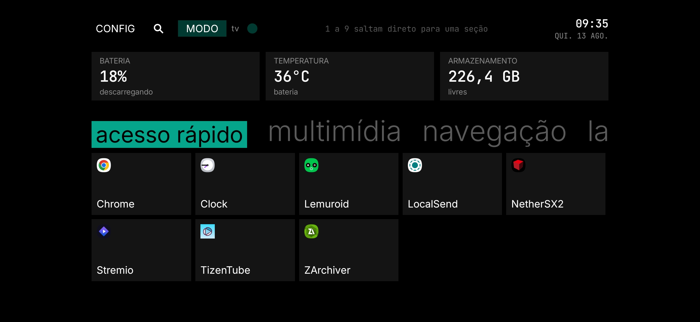
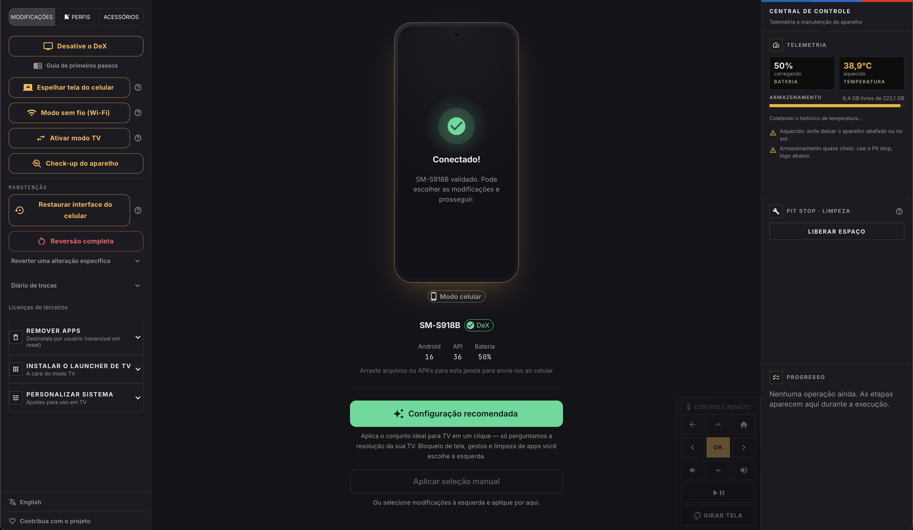

# Revya — Usando um celular samsung na TV através do DisplayPort Alt Mode

**Português** · [English](./README.en.md)

[](https://github.com/frx7-nat/revya-desktop/releases/download/v1.0.0/linux-Revya-1.0.0.AppImage)
[](https://github.com/frx7-nat/revya-desktop/releases/download/v1.0.0/windows-Revya-1.0.0-instalador.exe)
[](https://github.com/frx7-nat/revya-desktop/releases/download/v1.0.0/macos-Revya-1.0.0-intel.dmg)
[](https://github.com/frx7-nat/revya-desktop/releases/download/v1.0.0/macos-Revya-1.0.0-arm64.dmg)





Antes de darmos início, o programa não está disponível na
play store porque a camada de mudanças realizada por ele é
necessária para o maior aproveitamento do uso.

Então, é um processo que precisa necessariamente ocorrer através do computador.

O sistema é ajustado para tela grande, apps desnecessários saem,
e uma tela inicial é instalada e definida como padrão.

Quem faz essa preparação — do computador, pelo cabo — é este programa.
**É a única porta de entrada**: não existe instalar o launcher sozinho
pela Play Store, porque ele depende do aparelho já estar pronto para recebê-la.

O Revya é o que faz essa ponte entre o celular
que você tem hoje e a TV box que você quer ter.

## Funcionalidades

### Preparar o launcher Revya TV — a função central
Com o Galaxy conectado por cabo, o preset recomendado aplica de uma vez tudo
que é seguro em qualquer aparelho: remove bloatware por usuário (reversível),
ajusta o sistema para uso em TV (fonte, animações, som, tela sempre ligada) e
instala o launcher **Revya TV**, definindo-o como o padrão do modo TV. A
resolução é o único ajuste que o programa pergunta — cada TV é diferente.
Tudo é verificado direto no aparelho, não é promessa no escuro: o programa
confere se o launcher realmente ficou instalado e definido como padrão antes
de marcar a etapa como concluída.

### Instalar apps e emuladores
O programa não vem com nenhum aplicativo de terceiro embutido — nem
streaming, nem emulador, nem ferramenta. Você arrasta o `.apk`, `.apkm` ou
`.xapk` que já tem para a janela do Revya, e ele instala direto no celular
pelo cabo, sem passar pela loja. É assim que se monta a TV com os apps e
emuladores que você já usa.

### Transferir arquivos
Mesmo arrastar-e-soltar serve para levar filmes, músicas, fotos e ROMs de
emulador para o celular — cada tipo de arquivo já cai na pasta certa do
armazenamento, sem precisar navegar manualmente pela estrutura de pastas do
Android.

### Alternar entre modo celular e modo TV
O aparelho não fica preso num modo só. Um clique alterna entre a experiência
de TV e o celular do dia a dia, e o que foi personalizado de cada lado é
preservado — a resolução que você achou ideal na TV continua lá da próxima
vez, e o celular volta exatamente como estava. Detalhe técnico de como isso é
guardado logo abaixo, em "Os dois modos".

### Manutenção do aparelho
Check-up confere se os ajustes aplicados continuam valendo (o Android
reescreve alguns sozinho). Reversão desfaz qualquer alteração, isolada ou
todas de uma vez, guiada por um registro que sobrevive à troca de computador.
Limpeza libera o cache dos apps sem apagar dado nenhum.

---

Gratuito — a receita vem de doação (Pix e PayPal) e de links de afiliado dos
acessórios, não há versão paga, licença nem telemetria. Bilíngue: português e
inglês, 698 chaves de catálogo.

## Os dois modos

O conceito central do app, e o que separa este projeto de um script de ADB: o
aparelho **alterna** entre modo celular e modo TV, quantas vezes o usuário
quiser, sem perder o que ele personalizou de nenhum dos lados.

Cada entrada do registro de reversão guarda três camadas:

| camada | o que é |
| --- | --- |
| `revert` | o estado ORIGINAL, de antes da primeira aplicação |
| `phoneRevert` | o retrato VIVO do modo celular, recapturado a cada ida ao TV |
| `task` | o perfil TV vivo — o que o usuário ajustou vira o novo perfil |

Sem a camada do meio, voltar ao celular devolveria o aparelho ao estado de
meses atrás. Sem a terceira, o usuário perderia a resolução e a rotação que
descobriu servirem na TV dele. O `modeScope` de cada task (`mode` ou
`structural`) é o que decide o que alterna e o que fica.

## Estrutura

```
src/
  adb/
    adb.js              Wrapper de baixo nível em torno do adb (comandos por função)
    adbDiagnostics.js   Diagnóstico de estados do ADB em linguagem simples
    adbOrchestrator.js  Detecção + recuperação automática do servidor ADB
  i18n/
    pt.json / en.json   Catálogos em JSON
    index.cjs           Núcleo de tradução, em CommonJS — os DOIS processos leem
  main/
    main.js             Processo principal Electron + handlers IPC + ponte de modos
    preload.js          Ponte segura (contextBridge) main <-> renderer
    runner.js           Orquestrador: task do catálogo -> chamadas ADB (+ verificação)
    revertStore.js      Registro de reversão em disco (por serial de fábrica)
    settingsStore.js    Preferências do programa (hoje só o idioma)
    scrcpy.js           Espelhamento da tela do aparelho (scrcpy)
  renderer/
    Root.jsx            Gate de entrada: tela "Conecte seu Galaxy" antes do App
    App.jsx             Layout de 3 colunas e estado da aplicação
    theme/theme.js      Tema MUI (escuro, acento âmbar)
    theme/tokens.js     Tokens de cor dos painéis técnicos (design BMW M)
    data/tasks.js       Catálogo de modificações + preset recomendado (auditável)
    data/contribute.js  Doação (Pix/PayPal) e acessórios com link de afiliado
    utils/locale.js     Números e datas conforme o idioma
    screens/
      ConnectPhoneScreen.jsx  Tela-gate com diagnóstico ao vivo do ADB
    components/
      TaskPanel.jsx         Aba esquerda  — modificações, check-up e reversão
      DevicePanel.jsx       Aba central   — aparelho, preset, Wi-Fi, espelhamento
      ProgressPanel.jsx     Aba direita   — progresso passo a passo + relatório
      ControlCenter.jsx     Central de Controle (saúde, perfis, limpeza)
      HealthPanel.jsx / ProfilesPanel.jsx / CleanupPanel.jsx
      RemoteControl.jsx     Controle remoto virtual (teclas por ADB)
      SendOverlay.jsx       Arrastar-e-soltar arquivos para o celular
      ModeSwitchDialog.jsx  Alternância celular ⇄ TV
      CheckupDialog.jsx     Verifica se os ajustes aplicados continuam valendo
      ResetDialog.jsx       Reversão (+ exportar/importar registro)
      ContributeDialog.jsx / ContributeTab.jsx   Doação e acessórios
      DexGuideDialog.jsx / FirstSetupGuideDialog.jsx / SideloadGuideDialog.jsx
      PhoneMock.jsx / PhoneScreen.jsx / PhoneAccessories.jsx  Celular central
scripts/
  check-i18n.js         Guarda de tradução (roda no build; ver changeset/I18N.md)
  after-pack.js         Assinatura ad-hoc do .app antes do DMG (macOS)
  verify-win.js         Testa a integridade dos .exe gerados
build/
  installer.nsh         `CRCCheck off` — ver "Gerar instaladores"
docs/
  baseline.md           O que "funcionar" significa, verificado em aparelho real
  roteiro-erros-adb.md  Os seis cenários de falha de ADB, com o medido
  review/               A revisão de código de 28-29/07/2026, fase a fase
platform-tools/         (você adiciona) binários ADB por plataforma:
  win/                  adb.exe + AdbWinApi.dll + AdbWinUsbApi.dll
  mac/  linux/          adb (sem extensão, chmod +x)
scrcpy/                 (você adiciona) release oficial do scrcpy por plataforma
apks/                   só o APK próprio: launchers/{Launcher} Revya TV.apk
```

## Setup

1. `npm install`
2. Baixe o platform-tools do Google **de cada plataforma que for distribuir** e
   coloque os binários em `platform-tools/win`, `platform-tools/mac` e/ou
   `platform-tools/linux`. No Mac/Linux, `chmod +x` no binário `adb`.
3. (Opcional, para o espelhamento de tela) Baixe o release oficial do scrcpy e
   coloque o conteúdo em `scrcpy/<plataforma>/` — ver `scrcpy/README.txt`. Sem
   ele, o app tenta o scrcpy do sistema (PATH).
4. Coloque o APK do launcher em `apks/launchers/` (veja `apks/README.txt`).
   **Nenhum APK de terceiro entra aqui** — o programa não redistribui apps.

No CI (GitHub Actions), platform-tools e scrcpy são baixados automaticamente.

## Rodar

```
npm run dev     # Vite (5173) + Electron, com hot reload do renderer
npm start       # build do renderer + Electron sem servidor de dev
npm run check:i18n
```

## Gerar instaladores

```
npm run dist:win     # NSIS (instalador) + portable .exe, x64
npm run dist:mac     # .dmg (Intel x64 + Apple Silicon arm64)
npm run dist:linux   # AppImage + .deb
npm run verify:win   # testa a integridade dos .exe e imprime o SHA-256
```

Cada comando builda o renderer antes de empacotar. O filtro `${os}` no
`extraResources` inclui só os binários (ADB e scrcpy) da plataforma alvo. As
dependências de UI (React/MUI) ficam em `devDependencies` — o bundle do Vite já
embute tudo. Builds de Mac precisam rodar em macOS.

Três armadilhas resolvidas em 28/07/2026, todas registradas em `changeset/`:

- **macOS acusava "Malware Bloqueado".** Sem assinatura nenhuma, o Gatekeeper
  dava veredito `revoked` — que **não tem** o contorno de "abrir mesmo assim".
  `scripts/after-pack.js` assina o `.app` em modo ad-hoc antes do DMG.
- **O instalador do Windows dava "integrity check failed".** O portable
  funcionava e o instalador não; a diferença medida estava num bit do cabeçalho
  NSIS (`flags 0x4 = NO_CRC` no portable, `0x0` no instalador). `build/installer.nsh`
  desliga o CRC.
- **O app não fechava durante a atualização**, travando desinstalar e
  reinstalar. Resolvido em `main.js`: o pedido de fechamento só é interceptado
  quando parte do usuário (`win.isFocused()`).

> Antivírus apagam instaladores NSIS dentro do `$HOME` — inclusive numa pasta
> criada só para eles, o que foi tentado e **não** funcionou. A saída de
> Windows vai para `/private/tmp/dexarmor-build`.

## Decisões de design

- **Toda lógica ADB roda no main**, nunca no renderer — `contextIsolation`
  ligado, `nodeIntegration` desligado. O renderer só fala via `window.api`.
- **Catálogo de tasks separado da execução** (`data/tasks.js` vs `runner.js`):
  dá pra auditar a lista de pacotes sem ler código de execução.
- **Remoção só por usuário** (`pm uninstall --user 0`): reversível por reset de
  fábrica, mais seguro que mexer em partição de sistema.
- **Tudo que o app altera é registrado antes** (`revertStore.js`): cada task
  captura o estado anterior e o botão "Reverter alterações" desfaz na ordem
  inversa da aplicação. O registro é indexado pelo serial de fábrica
  (`ro.serialno`), então continua válido alternando entre USB e Wi-Fi, e pode
  ser exportado/importado para reverter a partir de outro computador.
- **Escrita verificada**: settings são lidos de volta após o `put`; falha
  silenciosa vira erro real. Uma leitura divergente é reconferida até
  estabilizar (~4,5 s), porque o One UI reescreve alguns valores por conta
  própria logo depois da troca de modo. O check-up reusa a mesma ideia.
- **Preset recomendado ≠ decisões do usuário**: o botão de 1 clique aplica só o
  que é seguro em qualquer aparelho; resolução da TV é perguntada num diálogo
  (com densidade pareada), e bloqueio de tela/streaming ficam na seleção manual.
- **Nenhum texto de interface no código**: tudo vem do catálogo, e três guardas
  quebram o build se faltar tradução. Elas não substituem abrir o app nos dois
  idiomas — ver `changeset/I18N.md`.

## Limites conhecidos

- Depuração USB precisa estar ligada manualmente pelo usuário — não há como
  automatizar esse passo inicial.
- Não vira Android TV de verdade; é uma experiência de TV sobre o Android/DeX.
- Apps "for TV" com checagem de leanback podem recusar instalação por sideload.
- Antes de remover qualquer pacote novo, valide: remover o pacote errado pode
  deixar o aparelho instável.
- Com a resolução 16:9 forçada, o painel do celular mostra a interface como uma
  faixa com barras pretas — é esperado; a imagem espelhada preenche a TV.
- Conexão sem fio por `adb connect ip:5555` não sobrevive a um reinício do
  servidor ADB, e nada a refaz sozinha; o app reconecta os endpoints que
  conhecia. A Depuração sem fio do Android (mDNS) não tem esse problema.
- Se a **Depuração sem fio** do Android estiver ligada *além* da conexão que o
  próprio app cria, o mesmo telefone aparece **duas vezes** no seletor de
  aparelho, com o mesmo rótulo. Escolher qualquer uma das duas funciona — o
  registro de reversão é indexado pelo serial de fábrica, então as duas apontam
  para a mesma entrada. Não é deduplicado porque distinguir as duas exige uma
  consulta a mais por aparelho no caminho de seleção, que é o trecho mais
  crítico do app; a ambiguidade incomoda menos que o risco de mexer ali.
